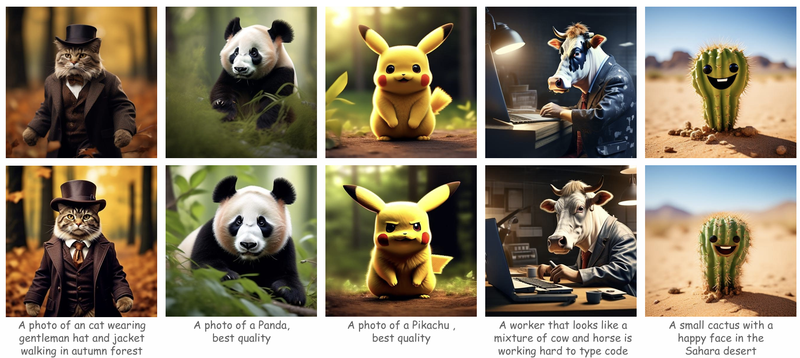

# TDM: Learning Few-Step Diffusion Models by Trajectory Distribution Matching
This is the Official Repository of "Learning Few-Step Diffusion Models by Trajectory Distribution Matching", by *Yihong Luo, Tianyang Hu, Jiacheng Sun, Yujun Cai, Jing Tang*.

<video width="320" height="240" controls>
    <source src="teacher.mp4" type="video/mp4">
</video>

<video src="teacher.mp4" controls="controls" width="500" height="300"></video>

## User Study Time!

Which one do you think is better? Some images are generated by Pixart-α (50 NFE). Some images are generated by  **TDM (4 NFE)**, distilling from Pixart-α in a data-free way with merely 500 training iterations and 2 A800 hours. 

 Click for answer

Answers of TDM's position (left to right): bottom, bottom, top, bottom, top.

## Fast Text-to-Video Geneartion

Our proposed TDM can be easily extended to text-to-video.

  
  

The Left is generated by Cog-VideoX-2B (100 NFE) on a single 4090 by around 90s. At the same time, our **TDM (4 NFE)** can generate 25 videos, as shown on the right! 25 times faster without performance degradation! (Note: The noise in the GIF is due to compression.)

## 🔥TODO 
- Pre-trained Models will be released soon.

## Contact

Please contact Yihong Luo (yluocg@connect.ust.hk) if you have any questions about this work.
